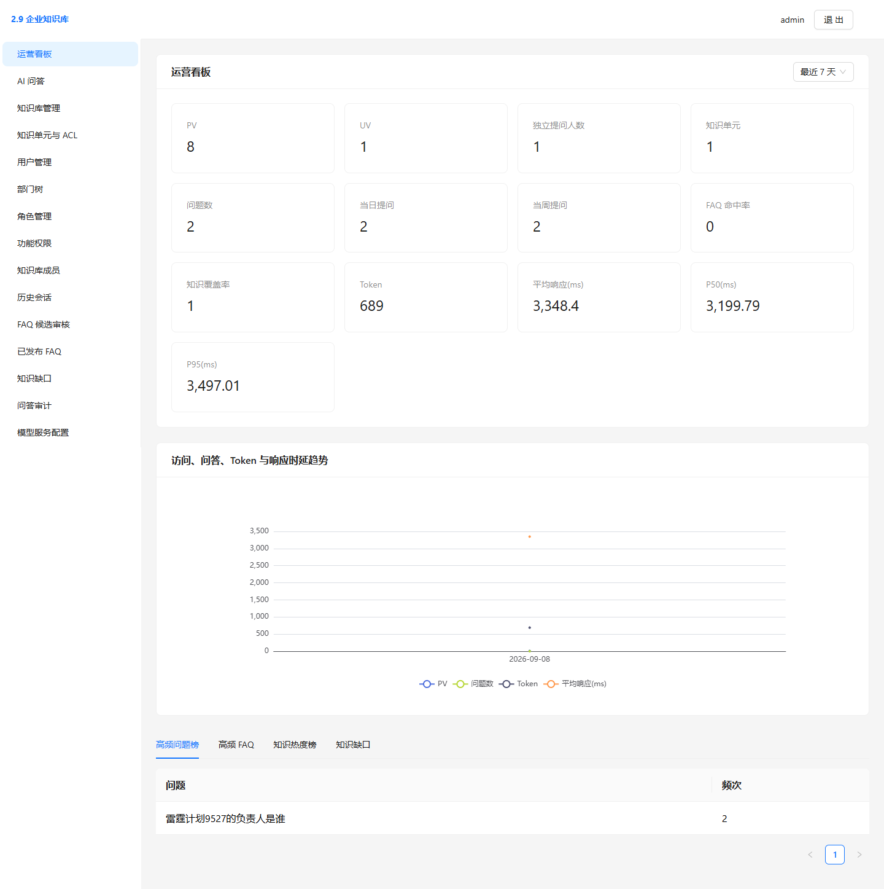
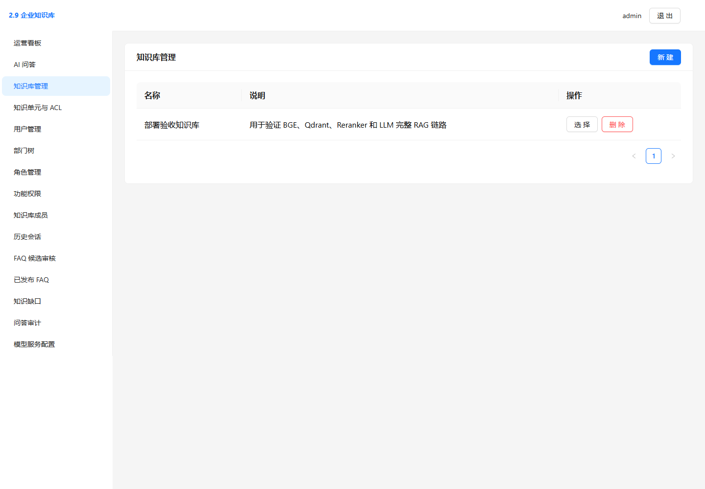
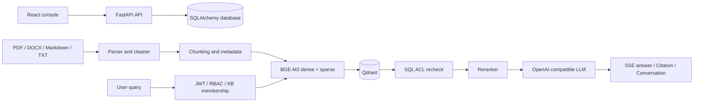

# 企业知识库管理平台

[English](README_EN.md)

一个面向多租户知识管理场景的 RAG 应用。项目包含 FastAPI 后端和 React 管理控制台，支持文档导入、混合检索、基于角色与文档 ACL 的权限控制、流式问答、引用追踪、FAQ 沉淀、知识缺口和运营看板。

这是项目的首个开源版本。仓库保留了真实实现、架构记录和本地演示截图，但不代表已有社区用户、生产采用或性能基准。

## Features

- PDF、DOCX、Markdown、TXT 单篇或批量导入，以及持久化导入任务、重建和删除生命周期。
- BGE-M3 dense+sparse 向量、Qdrant 检索、RRF 融合和 Reranker 精排。
- JWT 登录、RBAC、知识库成员关系，以及 global / department / role / user 四维文档 ACL。
- 在 Qdrant 过滤后继续执行关系数据库二次鉴权，避免未授权内容进入 Reranker、LLM 或 Citation。
- 同步与 SSE 流式问答、会话历史、Markdown 展示和受保护的引用正文。
- FAQ 候选挖掘、人工审核与发布、知识缺口聚合和知识补充任务。
- 基于真实业务事件的 Dashboard；未返回的 LLM usage 不做估算。
- React + TypeScript 管理控制台，包含组织权限、知识管理、问答、FAQ、Gap、Audit 和模型配置页面。

## Screenshots

以下内容来自本地演示数据，不表示公开用户量或线上服务指标。

| Dashboard | Knowledge management |
|---|---|
|  |  |

更多说明和健康检查截图见 [Screenshots](docs/截图/README.md)。

## Tech Stack

- Backend: Python 3.11+、FastAPI、Pydantic、SQLAlchemy、PyJWT、pwdlib、sse-starlette
- Vector search: Qdrant、BGE-M3 dense+sparse、RRF、Reranker
- Document parsing: pypdf、python-docx、内置 Markdown/TXT reader
- Frontend: React 19、TypeScript、Vite、Ant Design、ECharts
- Tests: `unittest`、FastAPI TestClient、Qdrant local mode

## Architecture



写入链路先解析和切分文档，再通过远程 BGE-M3 生成 dense+sparse 表示并写入 Qdrant。查询链路从认证上下文获取租户、知识库、部门和角色，执行向量过滤与 SQL ACL 复核后才允许内容进入 Reranker 和 LLM。Citation 在读取时会再次校验消息归属、文档版本和当前 ACL。

更详细的设计记录：

- [基础导入与混合检索](docs/architecture_ingestion_search.md)
- [身份、权限与安全 RAG](docs/architecture_security.md)
- [FAQ、知识缺口、指标与前端](docs/architecture_operations.md)

带日期的历史验证记录保存在 [安全版本验证](docs/historical_validation_security.md)、[全栈版本验证](docs/historical_validation_full_stack.md) 和 [初始范围覆盖记录](docs/initial_scope_coverage.md) 中；这些数据不作为当前性能基准。

## Quick Start

### Prerequisites

- Python 3.11 或更高版本；CI 使用 Python 3.12。
- Node.js `^20.19.0` 或 `>=22.12.0`；CI 使用 Node.js 24。
- 可访问的 BGE-M3 与 Reranker HTTP 服务。
- Qdrant Server，或用于本地开发的 Qdrant 本地持久化目录。
- 如需生成式问答，可访问 OpenAI-compatible Chat Completions 的 LLM 服务。

### Backend setup

```bash
git clone https://github.com/zzy11pp1-maker/knowledge-base-platform.git
cd knowledge-base-platform
python -m venv .venv
```

按所用终端激活虚拟环境：

```bash
# Linux / macOS
source .venv/bin/activate
```

```powershell
.\.venv\Scripts\Activate.ps1
```

安装依赖并创建本地配置：

```bash
python -m pip install -r requirements-dev.txt
cp .env.example .env
```

Windows PowerShell 可使用：

```powershell
Copy-Item .env.example .env
```

至少需要在 `.env` 中设置随机 `JWT_SECRET`，并配置 BGE、Reranker 和 Qdrant。无独立 Qdrant Server 时，可清空 `QDRANT_URL` 并设置：

```dotenv
QDRANT_LOCATION=./.local/qdrant
```

创建首个管理员。密码通过隐藏输入读取，不写入命令历史：

```bash
python bootstrap_admin.py --tenant your-tenant --username admin
```

启动 API：

```bash
python -m uvicorn main:app --host 127.0.0.1 --port 8080
```

可用入口：

- Swagger UI: `http://127.0.0.1:8080/docs`
- OpenAPI JSON: `http://127.0.0.1:8080/openapi.json`
- 基础健康检查: `GET http://127.0.0.1:8080/health`
- 管理员依赖检查: `GET /health/dependencies`

### Frontend

```bash
cd frontend
npm ci
npm run dev
```

开发服务器默认运行在 `http://127.0.0.1:5173`，并把 `/api` 代理到 `http://127.0.0.1:8080`。如需直接连接其他 API，可设置 `VITE_API_BASE`。

生产构建（在 `frontend` 目录执行）：

```bash
npm run build
```

## Configuration

所有运行配置均来自环境变量或项目根目录的 `.env`。`.env` 已被 Git 忽略；请只提交无密钥的 `.env.example`。

| Area | Variables | Notes |
|---|---|---|
| Identity | `JWT_SECRET`, `JWT_ISSUER`, `JWT_AUDIENCE` | `JWT_SECRET` 无默认值，建议使用至少 32 字节随机值 |
| Database | `DATABASE_URL` | 默认使用本地 SQLite；生产部署建议独立数据库和迁移工具 |
| Embedding | `BGE_BASE_URL`, `BGE_API_KEY`, `DENSE_VECTOR_SIZE` | 导入和检索需要 |
| Reranker | `RERANKER_BASE_URL`, `RERANKER_API_KEY` | 精排需要 |
| LLM | `LLM_BASE_URL`, `LLM_MODEL`, `LLM_API_KEY` | 问答生成需要；API Key 不会通过配置 API 回显 |
| Qdrant | `QDRANT_URL` 或 `QDRANT_LOCATION`, `QDRANT_API_KEY` | URL 与本地目录只能配置一个 |
| Retrieval | `RRF_K`, `SEARCH_CANDIDATE_LIMIT`, `RERANK_TOP_K` | 检索参数 |
| Ingestion | `MAX_UPLOAD_BYTES`, `MAX_CHUNK_SIZE`, `CHUNK_OVERLAP` | 上传与切分限制 |

完整变量及安全占位符见 [.env.example](.env.example)。

## Tests

不需要真实外部服务的单元与组件测试：

```bash
python -m unittest discover -s tests/unit -v
```

外部集成测试默认跳过。仅在已配置独立测试环境，并接受其写入后清理测试数据时启用：

```bash
RUN_EXTERNAL_INTEGRATION=1 python -m unittest discover -s tests -v
```

Windows PowerShell：

```powershell
$env:RUN_EXTERNAL_INTEGRATION = "1"
python -m unittest discover -s tests -v
```

仓库还保留了面向真实服务的 LLM、权限和 HTTP E2E 脚本。这些脚本不会在公共 CI 中执行，因为它们需要部署者自己的模型服务和凭据。

## API

主要接口包括：

- 身份与组织：`/auth/login`、`/auth/me`、`/users`、`/roles`、`/permissions`、`/departments`
- 知识库与成员：`/knowledge-bases`、`/knowledge-bases/{id}/members`
- 文档：`/documents/import/jobs`、`/documents/import/jobs/batch`、`/documents/{id}/reindex`
- 检索与问答：`/search`、`/chat`、`/chat/stream`
- 会话与引用：`/conversations`、`/conversations/{id}/messages`、`/citations/{message_id}/{chunk_id}`
- FAQ 与知识缺口：`/faq/candidates`、`/faqs`、`/knowledge-bases/{id}/gaps`
- 运营与配置：`/dashboard/summary`、`/metrics/page-view`、`/system/model-config`

以运行时生成的 Swagger/OpenAPI 文档为完整契约来源。

## Current Limitations

- 完整 RAG 链路依赖外部 BGE-M3、Reranker 和可选 LLM 服务；仓库不包含模型权重或托管服务。
- 默认 SQLite 和 Qdrant local mode 适合开发与功能验证，不代表生产并发或性能配置。
- 数据库目前使用启动时建表和有限兼容迁移，尚未接入 Alembic。
- 文档导入任务在应用进程内执行，尚无独立任务队列、分布式锁或失败补偿系统。
- PDF 仅提取文本层，不包含 OCR。
- 仓库未提供 Docker Compose、TLS、反向代理或 Kubernetes 配置。
- 管理控制台目前以中文为主，前端主包仍可进一步按路由拆分。

## Roadmap

以下是维护方向，不是交付承诺：

- 增加正式数据库迁移与 PostgreSQL 部署说明。
- 增加可复现的容器化开发环境。
- 将导入任务迁移到可恢复的后台任务系统。
- 改善前端按路由加载、可访问性和国际化。
- 补充评测数据集与可复现的检索质量基线。

## Contributing

欢迎提交问题和 Pull Request。开始前请阅读 [CONTRIBUTING.md](CONTRIBUTING.md)，并保持改动小而可验证。不要在 Issue、日志、测试夹具或提交中包含真实文档、凭据或私有服务地址。

## Security

请不要通过公开 Issue 披露可利用的安全细节。报告方式和支持范围见 [SECURITY.md](SECURITY.md)。

## License

本项目采用 [Apache License 2.0](LICENSE)。
